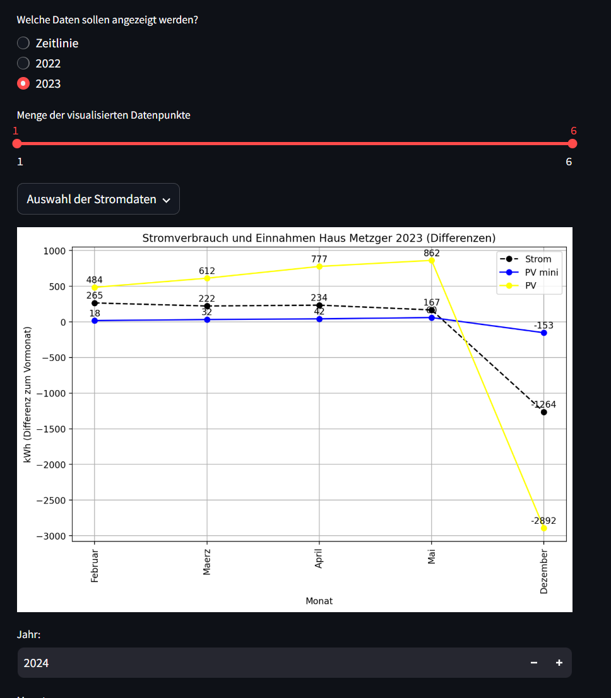

This App is a small app to track ones own electricity intake our outtake. Its in german since this app was created for my father who cant speak english. 

Basically you have a timeline and you can add something based on year and month. 
Currently hard coded to show statistics only until 2035.

to run locally:
pip install poetry
then
poetry install

to start the app:
streamlit run main.py  

To build:
docker build -t strom-app -f Dockerfile .

then

docker run -d -p 8501:8501 --name strom-app-container strom-app

